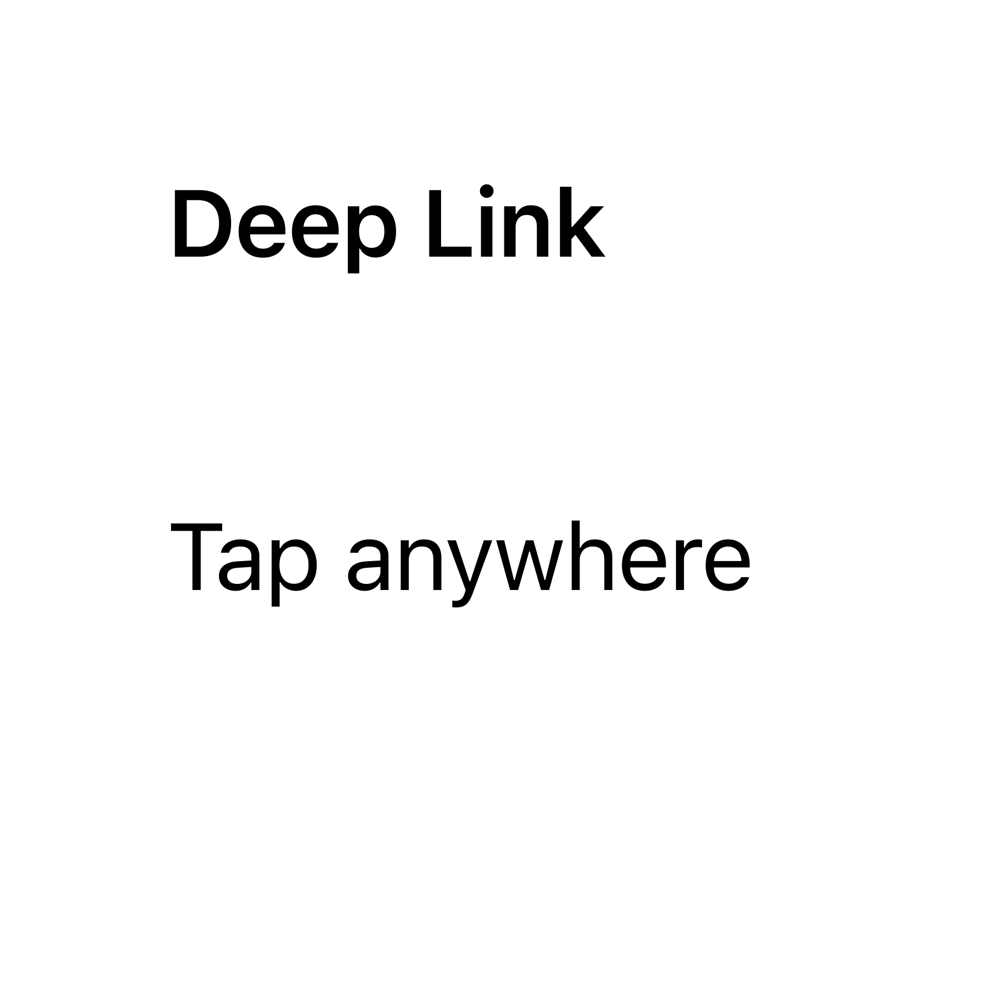
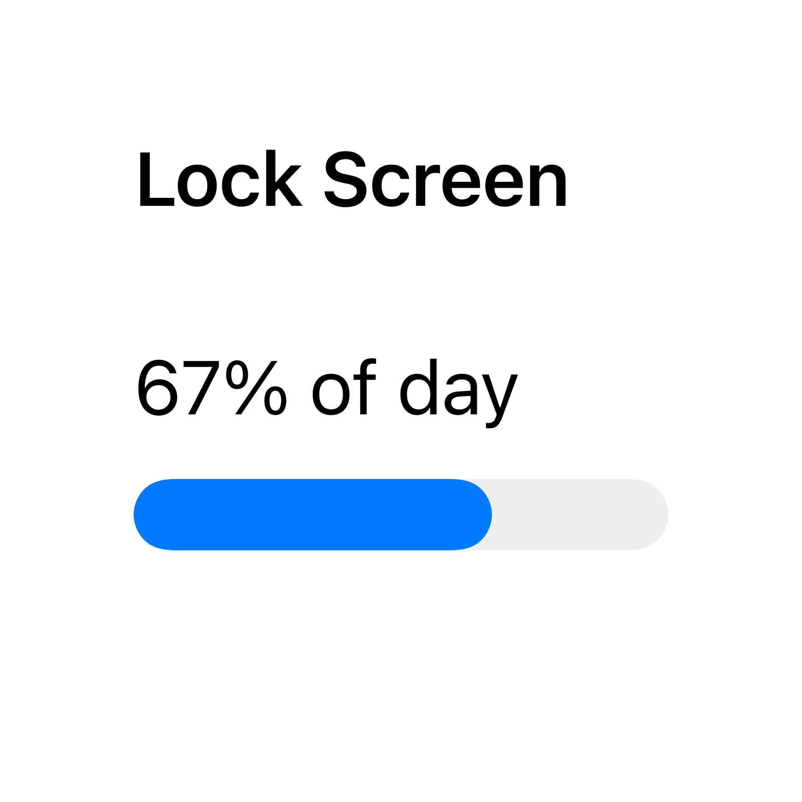
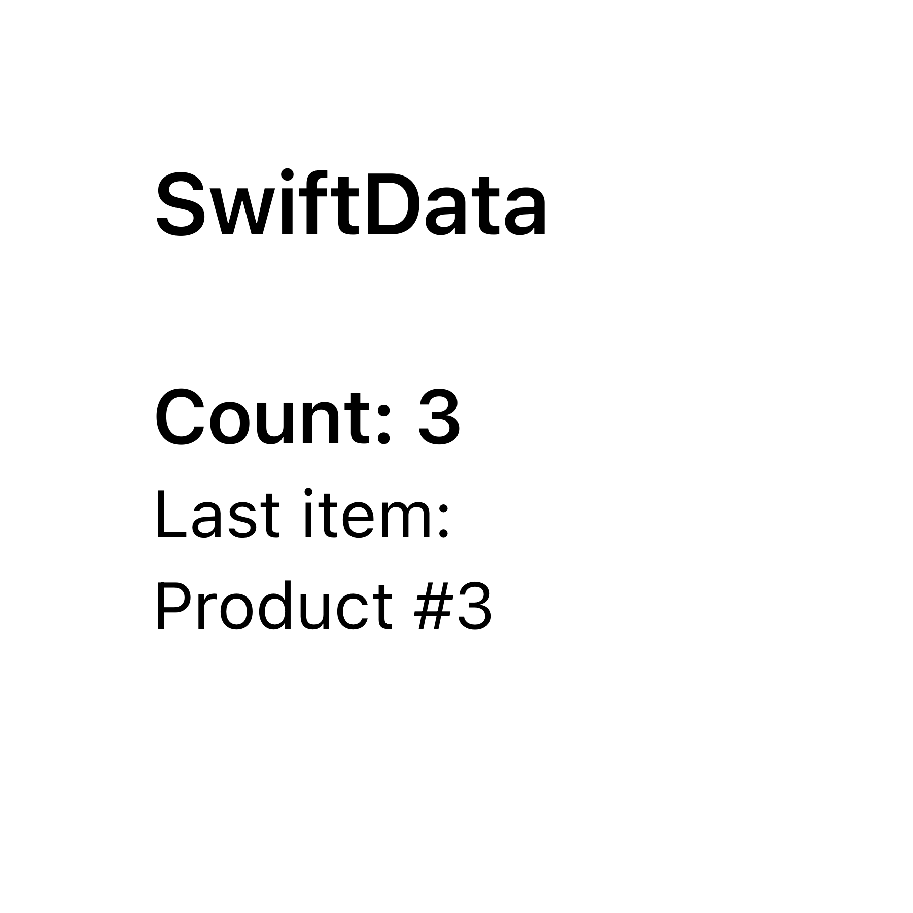
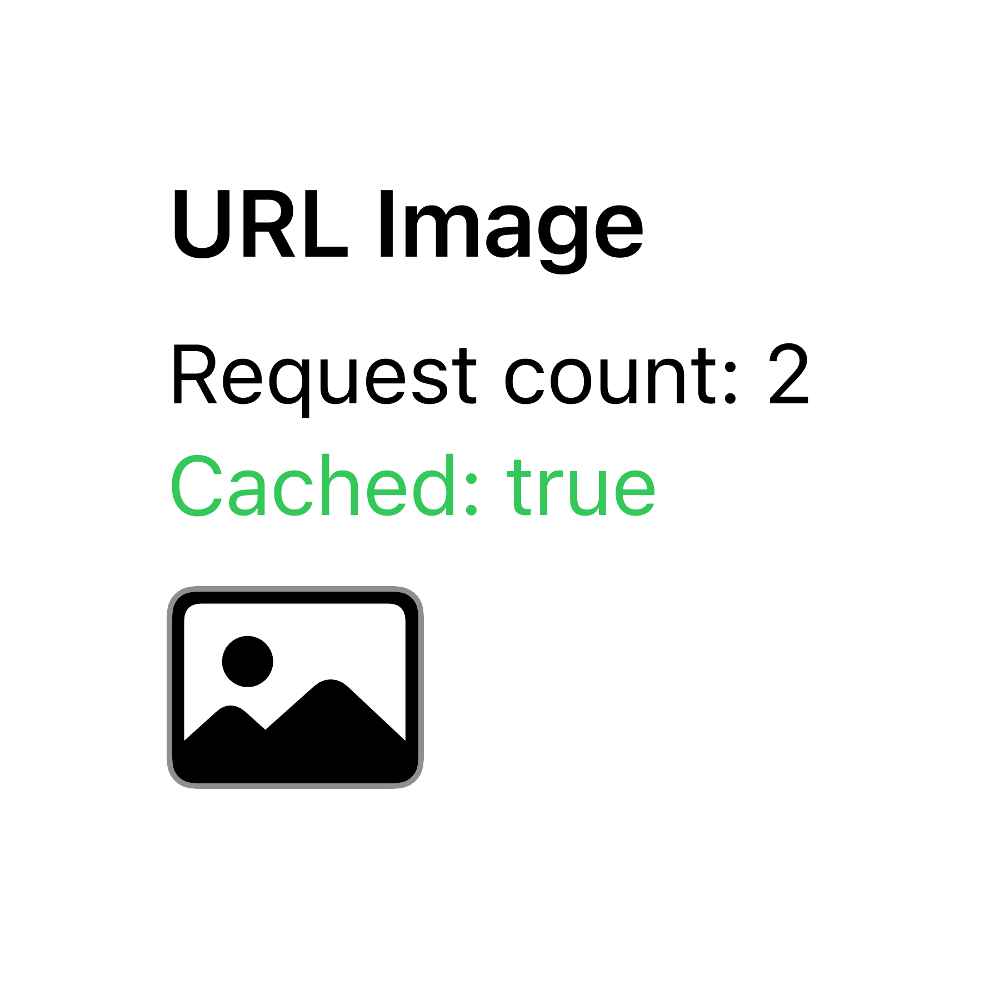

  
  
  
  

# Widget Examples

A demo project showing different types of Widgets created with SwiftUI and WidgetKit.

## Gallery

<table>
  <tr>
    <th align="center" width="25%">
      <a href="./Widgets/AppGroupWidget">App Group</a>
    </th>
    <th align="center" width="25%">
      <a href="./Widgets/CoreDataWidget">Core Data</a>
    </th>
    <th align="center" width="25%">
      <a href="./Widgets/CountdownWidget">Countdown</a>
    </th>
    <th align="center" width="25%">
      <a href="./Widgets/DeepLinkWidget">Deep Link</a>
    </th>
  </tr>
  <tr>
    <td align="center">
      
    </td>
    <td align="center">
      
    </td>
    <td align="center">
      
    </td>
    <td align="center">
      
    </td>
  </tr>
  <tr>
    <th align="center">
      <a href="./Widgets/DigitalClockWidget">Digital Clock</a>
    </th>
    <th align="center">
      <a href="./Widgets/DynamicIntentWidget">Dynamic Intent</a>
    </th>
    <th align="center">
      <a href="./Widgets/EnvironmentWidget">Environment</a>
    </th>
    <th align="center">
      <a href="./Widgets/IntentWidget">Intent</a>
    </th>
  </tr>
  <tr>
    <td align="center">
      
    </td>
    <td align="center">
      
    </td>
    <td align="center">
      
    </td>
    <td align="center">
      
    </td>
  </tr>
  <tr>
    <th align="center">
      <a href="./Widgets/InteractiveWidget">Interactive</a>
    </th>
    <th align="center" colspan="2">
      <a href="./Widgets/LiveActivityWidget">Live Activity</a>
    </th>
    <th align="center">
      <a href="./Widgets/LockScreenWidget">Lock Screen</a>
    </th>
  </tr>
  <tr>
    <td align="center">
      
    </td>
    <td align="center" colspan="2">
      
    </td>
    <td align="center">
      
    </td>
  </tr>
    <tr>
    <th align="center">
      <a href="./Widgets/NetworkWidget">Network</a>
    </th>
    <th align="center">
      <a href="./Widgets/SharedViewWidget">Shared View</a>
    </th>
    <th align="center">
      <a href="./Widgets/SwiftDataWidget">SwiftData</a>
    </th>
    <th align="center">
      <a href="./Widgets/URLImageWidget">URL Image</a>
    </th>
  </tr>
  <tr>
    <td align="center">
      
    </td>
    <td align="center">
      
    </td>
    <td align="center">
      
    </td>
    <td align="center">
      
    </td>
  </tr>
</table>

## Contents

### [App Group](./Widgets/AppGroupWidget)

Use an App Group to share data between the App and the Widget.

### [Core Data](./Widgets/CoreDataWidget)

Use Core Data to share data between the App and the Widget.

### [Countdown](./Widgets/CountdownWidget)

Display the remaining time in seconds and change color when the end date is approaching.

### [Deep Link](./Widgets/DeepLinkWidget)

Use Deep Links to pass information from the Widget when opening the parent App.

### [Digital Clock](./Widgets/DigitalClockWidget)

Display a digital clock that shows time in various formats.

### [Dynamic Intent](./Widgets/DynamicIntentWidget)

Configure the Widget with data that can be changed dynamically.

### [Environment](./Widgets/EnvironmentWidget)

Customize the Widget view depending on Environment variables.

### [Intent](./Widgets/IntentWidget)

Configure the Widget by changing its background type and color.

### [Interactive](./Widgets/InteractiveWidget)

Interact with elements of the Widget.

### [Live Activity](./Widgets/LiveActivityWidget)

Create a Live Activity to show the delivery status.

### [Lock Screen](./Widgets/LockScreenWidget)

Display the Widget on both the lock screen and the home screen.

### [Network](./Widgets/NetworkWidget)

Load data into the Widget from a network request.

### [Shared View](./Widgets/SharedViewWidget)

Display the Widget view directly in the parent App.

### [SwiftData](./Widgets/SwiftDataWidget)

Use SwiftData to share data between the App and the Widget.

### [URL Image](./Widgets/URLImageWidget)

Display an image downloaded from an external URL and cache it.

## Versions

This project has been updated for iOS 17.

You can download releases for different deployment targets:
- [current](https://github.com/pawello2222/WidgetExamples/releases/latest) (iOS 17.0+)
- [v0.6.2](https://github.com/pawello2222/WidgetExamples/releases/tag/0.6.2) (iOS 16.1+)
- [v0.6.0](https://github.com/pawello2222/WidgetExamples/releases/tag/0.6.0) (iOS 16.0+)
- [v0.5.0](https://github.com/pawello2222/WidgetExamples/releases/tag/0.5.0) (iOS 14.0+)

## Notes

Some widgets depend on the App Group capability or integrate with the main App. 

For this reason it is recommended to download the whole project to keep the configuration intact.

## License

Widget Examples project is available under the MIT license. See the [LICENSE](./LICENSE.md) file for more info.
