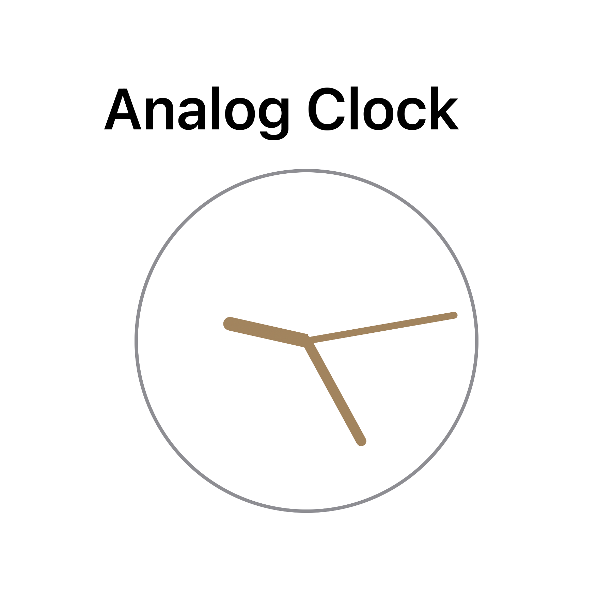

  

  
  
  
  

# Widget Examples

A demo project showing different types of Widgets created with SwiftUI and WidgetKit.

  

    <b>Table of Contents</b>
  

  1. [Basic widgets](#basic)
  2. [Intent widgets](#intent)
  2. [Unofficial widgets](#unofficial)
  3. [Installation](#installation)
  4. [License](#license)

## Basic widgets 

<table>
  <tr>
    <th align="center" width="25%">
      <a href="./Widgets/AppGroupWidget">App&nbsp;Group</a>
    </th>
    <th align="center" width="25%">
      <a href="./Widgets/CoreDataWidget">Core&nbsp;Data</a>
    </th>
    <th align="center" width="25%">
      <a href="./Widgets/CountdownWidget">Countdown</a>
    </th>
    <th align="center" width="25%">
      <a href="./Widgets/DeepLinkWidget">Deep&nbsp;Link</a>
    </th>
  </tr>
  <tr>
    <td align="center">
      
    </td>
    <td align="center">
      
    </td>
    <td align="center">
      
    </td>
    <td align="center">
      
    </td>
  </tr>
  <tr>
    <th align="center">
      <a href="./Widgets/DigitalClockWidget">Digital&nbsp;Clock</a>
    </th>
    <th align="center" colspan="2">
      <a href="./Widgets/LiveActivityWidget">Live&nbsp;Activity</a>
    </th>
    <th align="center">
      <a href="./Widgets/EnvironmentWidget">Environment</a>
    </th>
  </tr>
  <tr>
    <td align="center">
      
    </td>
    <td align="center" colspan="2">
      
    </td>
    <td align="center">
      
    </td>
  </tr>
    <tr>
    <th align="center">
      <a href="./Widgets/LockScreenWidget">Lock&nbsp;Screen</a>
    </th>
    <th align="center">
      <a href="./Widgets/NetworkWidget">Network</a>
    </th>
    <th align="center">
      <a href="./Widgets/SharedViewWidget">Shared&nbsp;View</a>
    </th>
    <th align="center">
      <a href="./Widgets/SwiftDataWidget">SwiftData</a>
    </th>
  </tr>
  <tr>
    <td align="center">
      
    </td>
    <td align="center">
      
    </td>
    <td align="center">
      
    </td>
    <td align="center">
      
    </td>
  </tr>
  <tr>
    <th align="center" width="25%">
      <a href="./Widgets/URLImageWidget">URL&nbsp;Image</a>
    </th>
    <th align="center" width="25%"></th>
    <th align="center" width="25%"></th>
    <th align="center" width="25%"></th>
  </tr>
  <tr>
    <td align="center">
      
    </td>
    <td align="center"></td>
    <td align="center"></td>
    <td align="center"></td>
  </tr>
</table>

## Intent widgets 

The following widgets use Intents. Please refer to the [documentation](https://developer.apple.com/documentation/appintents/appintent) for a more detailed explanation.

<table>
  <tr>
    <th align="center">
      <a href="./Widgets/AudioPlaybackWidget">Audio&nbsp;Playback</a>
    </th>
    <th align="center">
      <a href="./Widgets/DynamicIntentWidget">Dynamic&nbsp;Intent</a>
    </th>
    <th align="center">
      <a href="./Widgets/IntentWidget">Intent</a>
    </th>
    <th align="center">
      <a href="./Widgets/InteractiveWidget">Interactive</a>
    </th>
  </tr>
  <tr>
    <td align="center">
      
    </td>
    <td align="center">
      
    </td>
    <td align="center">
      
    </td>
    <td align="center">
      
    </td>
  </tr>
</table>

## Unofficial widgets 

The folowing widgets use private API. Please bear in mind that they don't necessarily have to pass the Apple review process and you use them at your own risk.

<table>
  <tr>
    <th align="center" width="25%">
      <a href="./Widgets/AnalogClockWidget">Analog&nbsp;Clock</a>
    </th>
    <th align="center" width="25%"></th>
    <th align="center" width="25%"></th>
    <th align="center" width="25%"></th>
  </tr>
  <tr>
    <td align="center">
      
    </td>
    <td align="center"></td>
    <td align="center"></td>
    <td align="center"></td>
  </tr>
</table>

## Installation 

It is recommended to download the whole project to keep the configuration intact as some widgets depend on the App Group capability or integrate with the main App.

### Versions

This project requires iOS 17.

You can also download releases for previous deployment targets:
- [v0.6.2](https://github.com/pawello2222/WidgetExamples/releases/tag/0.6.2) (iOS 16.1+)
- [v0.6.0](https://github.com/pawello2222/WidgetExamples/releases/tag/0.6.0) (iOS 16.0+)
- [v0.5.0](https://github.com/pawello2222/WidgetExamples/releases/tag/0.5.0) (iOS 14.0+)

## License 

Widget Examples project is available under the MIT license. See the [LICENSE](./LICENSE.md) file for more info.
